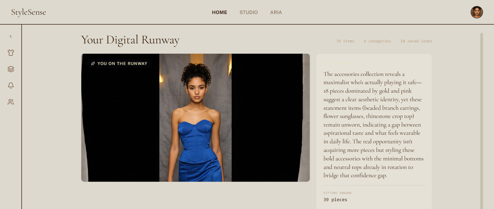
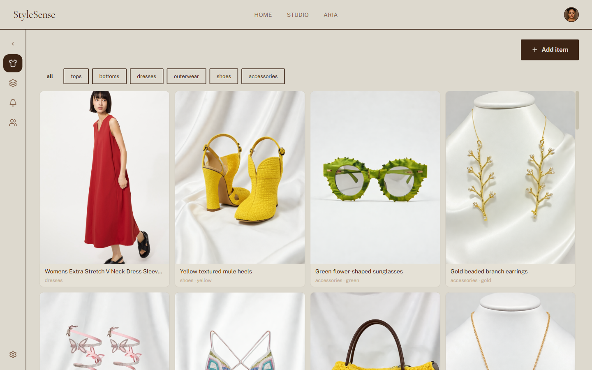
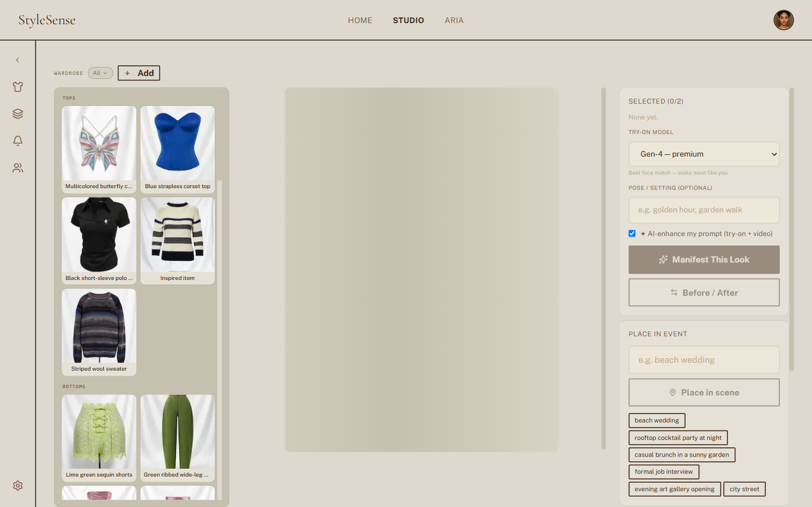
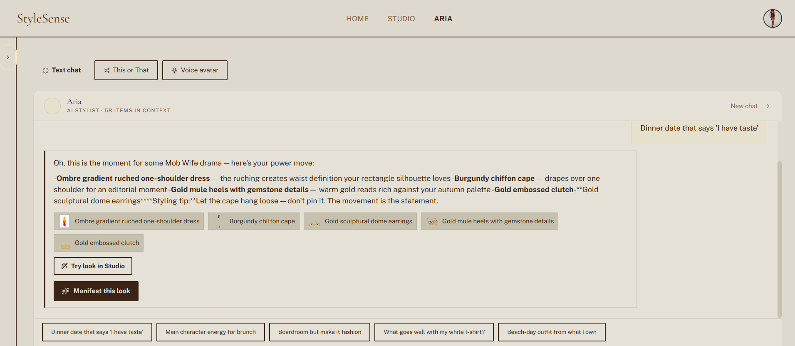

# StyleSense — AI-Powered Personal Wardrobe & Try-On

> Built for the **AWS + Runway AI Hackathon** · May–June 2026

## Live deployment (`master`)

| Service | URL |
|---------|-----|
| **Frontend** (Vercel, `master`) | [https://style-sense-beryl.vercel.app](https://style-sense-beryl.vercel.app) |
| **Backend** (Render, `master`) | [https://styleai-backend-5vk9.onrender.com](https://styleai-backend-5vk9.onrender.com) |
| **API health** | `GET /health` → `{"status":"ok"}` |
| **API docs** | [https://styleai-backend-5vk9.onrender.com/docs](https://styleai-backend-5vk9.onrender.com/docs) |

Vercel project **style-sense** tracks `github.com/ihddirmas/StyleSense` branch **`master`** with root directory `frontend/`.  
Set `NEXT_PUBLIC_API_URL` and `NEXT_PUBLIC_SITE_URL` in Vercel if you override defaults; otherwise `frontend/.env.production` and `lib/api-base.ts` point at the URLs above.

Vercel project **style-sense** tracks `github.com/ihddirmas/StyleSense` branch **`master`** with root directory `frontend/`.

## Backblaze Generative AI Media Hackathon (2026)

StyleSense is submitted to the **Backblaze + Genblaze** hackathon as an **agentic fashion media app**:

- **Genblaze** orchestrates Runway image-to-video (`Pipeline` + `RunwayProvider`) and ingests try-on stills with SHA-256 provenance manifests.
- **Backblaze B2** durably stores generated images, videos, and manifests (beyond short-lived Runway URLs).

Full Devpost copy, judging alignment, demo script, and env setup: **[docs/hackathons/BACKBLAZE_GEN_MEDIA_2026.md](docs/hackathons/BACKBLAZE_GEN_MEDIA_2026.md)**

```bash
# Optional B2 + Genblaze (see backend/.env.example)
cd backend && ./venv/bin/python -m scripts.test_genblaze_smoke
```

## The Wow Moment

Upload a selfie → add clothes from Amazon URLs → see yourself wearing them via Runway → place yourself at a "beach wedding" → animate as a 5-second runway video → talk to an AI stylist that knows your entire wardrobe.

## Features

- **Virtual Try-On** — Runway `gen4_image` composites your face onto any outfit
- **Event Scene Placement** — `gen4_image` puts your try-on in any setting ("rooftop cocktail party at night")
- **Runway Walk Video** — `gen4.5` image-to-video animates any try-on into a 5-second catwalk clip
- **AI Stylist (Aria)** — **Agentic** LangGraph stylist: wardrobe-aware picks, tool calling (`generate_tryon`, product URL lookup), human-in-the-loop pending actions — not basic chat
- **Durable media (B2 + Genblaze)** — Try-ons and runway videos archived to Backblaze B2 with SHA-256 provenance manifests (hackathon integration)
- **Smart Wardrobe** — Add items by URL (Myntra, Amazon, Uniqlo) or photo upload; Claude vision auto-categorizes multi-item hauls
- **Social Loop** — Friends, real-time chat, share outfits and try-ons with friends

## Runway API Coverage

| API | How We Use It |
|-----|--------------|
| `gen4_image_turbo` | Garment background removal + isolation (2 cr each) |
| `gen4_image` | Try-on compositing + event scene placement (5 cr each) |
| `gen4.5` (image-to-video) | Animate try-on → 5s runway walk video (60–100 cr) |
| Characters / `gwm1_avatars` | Aria voice avatar with wardrobe knowledge via WebRTC |
| Knowledge Base | Wardrobe text sync → Aria answers with specific item IDs |

## Tech Stack

| Layer | Tech |
|-------|------|
| Frontend | Next.js 14 App Router · TypeScript · Tailwind · Framer Motion · Zustand |
| Backend | Python 3.12 · FastAPI · LangGraph (agentic stylist) |
| Auth | Supabase Auth (JWT, email/password) |
| Database | Supabase (single project DB for core + auth + social) |
| Storage | Supabase Storage (public HTTPS for Runway) + Realtime |
| AI | Runway SDK · Anthropic Claude (claude-haiku-4-5 stylist chat + vision) |

## Architecture

```mermaid
flowchart TD
    classDef aws fill:#FF9900,color:#fff,stroke:#333,stroke-width:2px
    classDef runway fill:#6B46C1,color:#fff,stroke:#333,stroke-width:2px
    classDef app fill:#1E1B18,color:#F7F1EA,stroke:#DAA520,stroke-width:2px
    classDef supabase fill:#3ECF8E,color:#fff,stroke:#333,stroke-width:2px
    classDef client fill:#4A90D9,color:#fff,stroke:#333,stroke-width:2px

    User((User)):::client

    subgraph FE [Frontend — Next.js 14 on Vercel]
        Pages[Pages: Dashboard · Wardrobe · Studio · Stylist · Outfits · Chat]
        SDK[@runwayml/avatars-react WebRTC Widget]
    end
    FE:::app

    subgraph BE [Backend — FastAPI]
        API[REST API :8000]
        Routers[avatar · tryon · wardrobe · outfits · stylist · friends · chat]
        Services[runway_service · supabase_service · garment_cleaner]
        Graphs[LangGraph: Aria Agentic Stylist]
    end
    BE:::app

    subgraph SUPABASE [Supabase]
        Auth[Auth — JWT]
        Storage[Storage — wardrobe · selfies · tryons]
        PG[(Core DB — users · wardrobe · try-ons · stylist_sessions)]
        Social[Social — profiles · friendships · messages · Realtime]
    end
    SUPABASE:::supabase

    subgraph RUNWAY [Runway AI]
        Characters[Characters API — WebRTC Avatar]
        Gen4[gen4_image / turbo — Try-On + Scene]
        Gen45[gen4.5 — Image-to-Video]
        KB[Knowledge Base — Wardrobe Sync]
    end
    RUNWAY:::runway

    User -->|HTTPS| Pages
    Pages -->|REST| API
    SDK -->|WebRTC| Characters
    API -->|JWT verify| Auth
    API -->|SQLAlchemy| PG
    API -->|Storage SDK| Storage
    API -->|Realtime| Social
    Services -->|Runway SDK| Gen4
    Services -->|Runway SDK| Gen45
    Services -->|Runway SDK| Characters
    Graphs -->|Tool calling| Characters
    Graphs -->|Knowledge sync| KB
```

## Screenshots

| Dashboard | Wardrobe | Studio | Stylist |
|-----------|----------|--------|---------|
|  |  |  |  |

## Local Setup

### Prerequisites
- Python 3.12 · Node.js 18+ · Supabase project · Runway API key · Anthropic API key

### Backend

```powershell
cd backend
python -m venv venv
.\venv\Scripts\activate
pip install -r requirements.txt
# Copy .env.example → .env and fill in secrets
uvicorn main:app --port 8000 --log-level warning
```

Required `.env` keys:
```
RUNWAY_API_KEY=
SUPABASE_URL=
SUPABASE_SERVICE_KEY=
SUPABASE_ANON_KEY=
ANTHROPIC_API_KEY=
STYLIST_CHARACTER_ID=   # from: python -m scripts.setup_admin_stylist
STYLIST_HERO_VIDEO_URL= # from: python -m scripts.animate_admin_stylist
DATABASE_URL=           # Supabase connection string (Settings → Database)
```

### Database (Supabase)

Apply schema migrations in order in the Supabase SQL editor:
```
backend/supabase_schema.sql
backend/supabase_schema_v2_social.sql
backend/supabase_schema_v2b_fix.sql  (through v2h)
backend/supabase_schema_v2j_consolidate_core.sql
```

Verify connectivity: `cd backend && ./venv/bin/python -m scripts.check_db`

**Migrating from a split-DB setup:** apply `v2j`, set `LEGACY_DATABASE_URL` and `DATABASE_URL`, run
`python -m scripts.migrate_legacy_db_to_supabase`, then remove legacy env vars on Render.

### Frontend

```powershell
cd frontend
npm install
# Copy .env.local.example → .env.local and fill in secrets
npm run dev   # http://localhost:3000
```

Required `.env.local` keys:
```
NEXT_PUBLIC_SUPABASE_URL=
NEXT_PUBLIC_SUPABASE_ANON_KEY=
NEXT_PUBLIC_API_URL=http://localhost:8000
RUNWAYML_API_SECRET=
NEXT_PUBLIC_STYLIST_CHARACTER_ID=
NEXT_PUBLIC_STYLIST_HERO_VIDEO_URL=
```

### One-time Admin Setup

```powershell
# Create Aria (shared AI stylist voice avatar)
cd backend
.\venv\Scripts\python.exe -m scripts.setup_admin_stylist
# Paste STYLIST_CHARACTER_ID into both .env files

# Generate Aria's ramp-walk hero video
.\venv\Scripts\python.exe -m scripts.animate_admin_stylist
# Paste STYLIST_HERO_VIDEO_URL into both .env files
```

## Demo Path

```
Landing → Sign Up → Onboarding (selfie upload)
→ Wardrobe (add item via Amazon URL)
→ Studio (select items → try-on → event scene → animate)
→ Stylist (chat with Aria about the look)
→ Friends (share the try-on with a friend)
```

## Smoke Tests

```powershell
cd backend
.\venv\Scripts\python.exe -m tests.test_runway_smoke    # cheapest (~2 cr)
.\venv\Scripts\python.exe -m tests.test_supabase_smoke
.\venv\Scripts\python.exe -m tests.test_anthropic_smoke
.\venv\Scripts\python.exe -m tests.test_auth_flow
```

## Runway Credit Budget

| Operation | Credits |
|-----------|---------|
| `gen4_image_turbo` (garment cleanup) | 2 cr |
| `gen4_image` (try-on / event scene) | 5 cr |
| `gen4.5` (5s video) | 60–100 cr |
| Character creation (one-time) | ~5 cr |

Total budget: 50,000 cr. Use turbo during dev; switch to full quality for demo recording.
