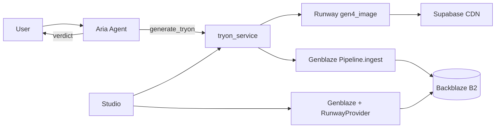

# Backblaze Generative Media Hackathon — placement strategy

> **Goal:** Top 3 ($1,000+) among ~1,275 registered / ~600 likely submissions  
> **Deadline:** August 3, 2026, 5:00 PM ET  
> **Devpost:** [backblaze-generative-media.devpost.com](https://backblaze-generative-media.devpost.com/)

---

## Why StyleSense can place (honest assessment)

| Criterion | Weight | Our edge | Risk |
|-----------|--------|----------|------|
| **Real-world utility** | High | **Personal style intelligence** (color season + Kibbe + grounded verdicts on owned items + URLs) — sharper than “another try-on demo” | Judges must see Aria verdict flow, not only Studio |
| **Production readiness** | High | Live Vercel + Render, auth, usage caps, PostHog, multi-user DB | B2 **must** be configured on production Render |
| **B2 storage & orchestration** | **Hackathon core** | Hierarchical keys per user, try-on ingest + video sink, manifest hashes on DB rows | Invisible if B2 env missing — judges see no archive |
| **Genblaze** | **Hackathon core** | `Pipeline.ingest` + `Pipeline` + `RunwayProvider` animate with `ObjectStorageSink` | Animate was hidden by MVP cut list — **fixed via `HACKATHON_MODE`** |

**Third place is realistic** if: (1) production B2 works, (2) demo video shows **prompt → Genblaze pipeline → B2 → provenance UI**, (3) Devpost copy leads with B2/Genblaze not just Runway.

Many submissions will be one-shot demos without durable storage or multi-step pipelines. Our **agent + ingest + animate + manifests** is differentiated.

---

## Judge demo flow (5 minutes — paste into Devpost)

1. **Login** with test account (wardrobe + selfies pre-seeded).
2. **Aria** (`/stylist`) — *“I found this coral top on Myntra [URL] — does it suit my Summer palette?”*  
   → Verdict with undertone reasoning (utility).
3. **Studio** — select 2 wardrobe items → **Generate try-on** (proof).  
   → Toast: *“Archived to B2 (Genblaze manifest)”* if B2 configured.
4. **Proof video** panel — **Animate** (Genblaze → B2).  
   → Toast: *“Genblaze pipeline → Backblaze B2”*.
5. Open try-on detail — **B2 archive** chip + manifest hash prefix.
6. Optional: `GET https://styleai-backend-5vk9.onrender.com/health` → `"b2_configured": true`  
   and `GET .../api/media/status` for pipeline description.

---

## Production checklist (do before submit)

- [ ] **Render:** `B2_BUCKET`, `B2_KEY_ID`, `B2_APP_KEY`, `B2_PUBLIC_URL_BASE` set  
- [ ] **Vercel:** `NEXT_PUBLIC_HACKATHON_MODE=true` (default — keeps animate + provenance UI)  
- [ ] Run `python -m scripts.test_genblaze_smoke` against production bucket  
- [ ] Seed judge account: selfies, full-body, 10+ wardrobe items  
- [ ] Grant **https://github.com/b2genblaze** on repo if private  
- [ ] 3-min demo video uploaded (script below)  
- [ ] Devpost: B2 + Genblaze paragraph from this doc  
| Criterion | How StyleSense scores |
|-----------|----------------------|
| **Real-world utility** | Virtual try-on + event scenes + shareable looks; Aria picks real wardrobe items (`[ITEM:uuid]`) for a stated occasion. |
| **Production readiness** | Live Vercel + Render deploy, auth, usage caps, rate limits, Aurora + Supabase, keep-alive on backend. |
| **Production readiness** | Live Vercel + Render deploy, auth, usage caps, rate limits, Supabase DB, keep-alive on backend. |
| **B2 storage & orchestration** | B2 bucket stores ingested try-ons + Genblaze-run videos; hierarchical keys per user; public or signed URLs via `B2_PUBLIC_URL_BASE`. |
| **Genblaze** | `Pipeline` + `RunwayProvider` for animate; `Pipeline.ingest` for try-on archive; manifests verified with `manifest.verify()`. |

---

## Elevator pitch (updated for MVP + hackathon)

**StyleSense** helps shoppers know **what actually flatters them** — color season, Kibbe body type, and an agentic stylist (Aria) that gives grounded **Suits / Borderline / Avoid** verdicts on clothes they own or paste from Myntra/Amazon.

Virtual try-on is the **proof layer**, not the product. For this hackathon we wired a **production media pipeline**: **Genblaze** orchestrates Runway image-to-video and **ingests** try-on stills with **SHA-256 provenance manifests**; **Backblaze B2** is the durable archive beyond ephemeral Runway URLs.

---

## Problem & audience

**Who:** Women 18–30, metro India, buying on Myntra/Amazon — tired of returns and unworn purchases.

**Pain:** They watch color-analysis TikToks but can’t apply it to *their* closet or a product URL in the moment.

**Why B2 matters:** Generated looks are expensive to recreate; provider URLs expire. B2 + manifests = wardrobe media library + audit trail.

---

## What we built (judging criteria map)

| Criterion | How StyleSense scores |
|-----------|----------------------|
| **Real-world utility** | Color + Kibbe profiles + Aria verdicts on URLs/wardrobe; try-on optional proof. |
| **Production readiness** | Deployed app, auth, caps, agent confirm flow, health + `/api/media/status`. |
| **B2 storage & orchestration** | Per-user hierarchical keys; `b2_image_url` / `b2_video_url` + manifest hashes on `try_on_results`. |
| **Genblaze** | `Pipeline.ingest` (try-on archive) + `Pipeline` + `RunwayProvider` (animate) → `ObjectStorageSink`. |

---

## B2 usage

**Bucket layout** (`KeyStrategy.HIERARCHICAL`):

```
{user_id}/stylesense-tryon/...    # Genblaze ingest + manifest
{user_id}/stylesense-animate/...  # Genblaze video pipeline + manifest
```

**Dual-tier storage:** Supabase = hot CDN for UI; B2 = cold durable archive with provenance.

**Env:** `B2_BUCKET`, `B2_KEY_ID`, `B2_APP_KEY`, optional `B2_REGION`, `B2_PUBLIC_URL_BASE`.

---

## Genblaze usage

See `backend/services/genblaze_media_service.py`:

1. **`Pipeline.ingest`** — after Runway try-on, archive still to B2 with metadata (`user_id`, `tryon_id`, `model_used`, `item_ids`).
2. **`Pipeline` + `RunwayProvider`** — image-to-video animate → B2 sink + manifest.
3. **Agent hook** — Aria `generate_tryon` → same try-on service → ingest.

Verify: `manifest.verify()` + PostHog `media_provenance_archived`.

---

## Demo video script (~3 min)

| Time | Content |
|------|---------|
| 0:00–0:25 | Problem: buying clothes that don’t flatter you; color season confusion |
| 0:25–0:50 | Onboarding: face + body → **Summer** + **Kibbe** profile cards |
| 0:50–1:30 | **Aria**: paste product URL → **Avoid** — warm coral vs cool undertone |
| 1:30–2:00 | **Studio** try-on → toast **B2 archive** + manifest banner |
| 2:00–2:30 | **Genblaze animate** → video on B2; show manifest in UI |
| 2:30–2:50 | Architecture slide: prompt → Runway → Genblaze → B2 |
| 2:50–3:00 | Live URL + production (auth, deploy) |

---

## Devpost form — B2 + Genblaze (copy-paste)

StyleSense uses **Genblaze** to run Runway image-to-video inside a `Pipeline` with a Backblaze B2 `ObjectStorageSink`, emitting verifiable SHA-256 manifests for each animate run. Try-on stills are archived via **`Pipeline.ingest`** after generation, with provenance metadata (user, try-on id, models, item ids). Supabase serves low-latency UI assets; **B2 is the durable system of record** with `image_manifest_hash` / `video_manifest_hash` on each look.

---

## Architecture



---

## Links

- [Genblaze](https://github.com/backblaze-labs/genblaze) · [B2 docs](https://www.backblaze.com/docs/cloud-storage-genblaze-developer-guide)
- Full setup: `backend/scripts/test_genblaze_smoke.py`
- API: `GET /health` · `GET /api/media/status`
